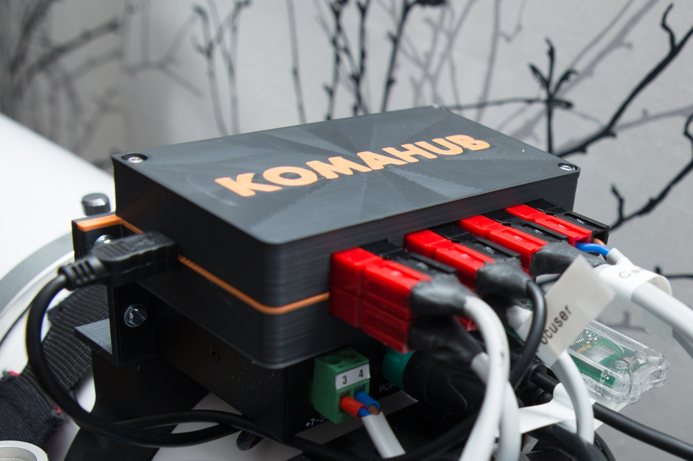
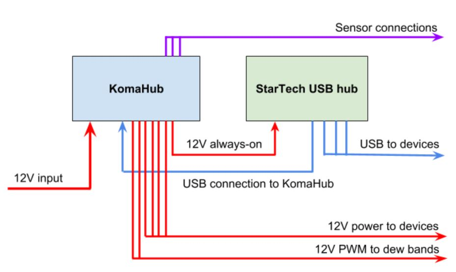

KomaHub is an intelligent power and sensor hub designed for astronomical applications. It’s particularly useful for running a remote control astrophotography setup. Typical use cases are:

- Troubleshoot a stuck device by power cycling
- Turn off a camera with no software fan control for daytime, for saving the fan
- Keep equipment powered on for preventing condensation
- Automatic dew heater control, following temperature and dewpoint
- Collect sensor data of sky quality during exposures

Manual available [in Finnish](manual-finnish.html)

Download control software from the [releases page](https://github.com/komakallio/komahub/releases).

**Main features**:
- Six (6) intelligent switchable 12 V outputs
  - Maximum current 8 A per port, 15 A total
  - Chip level protection for overload, overtemperature, polarity and short circuit
  - Continuous current measurement on each port
  - Fast tripping soft fuse with user-definable current limit
- One always-on 12 V output, 15 A maximum
- Any output can use PWM to control dew heaters
  - Slow PWM frequency to prevent RF interference with camera
  - Outputs 1 and 2 can also use fast (xx khz) PWM for e.g. controlling fans (external filtering circuit may be required)
- Input voltage monitoring
- High-quality Anderson Powerpole connectors
- RJ45 port and two 3.5 mm stereo jacks for external sensors
  - Temperature + humidity + pressure sensor
  - 1-wire temperature sensors
  - Cloud sensor
  - Sky quality (darkness) sensor
- Atmel ATmega32U4 microcontroller
- Computer connection with USB HID - no need for serial port drivers
- Control software for Windows
- ASCOM ObservingConditions driver
- ASCOM SafetyMonitor driver for a clean shutdown if running on batteries
- Open firmware, communication protocol, drivers and software

The KomaHub is designed to be used with StarTech industrial USB hubs that accept 12V input voltage and have proven to be very reliable. This way the always-on power output can be connected to the hub, making KomaHub always available to the computer. You can also chain KomaHubs together via the always-on port, but the total current level may not exceed 15 amperes.

## Power Switching

The main KomaHub feature is six computer-controlled 12V ports capable of delivering up to 8 A per channel or 15 A in total. The switching is implemented with latest Infineon PROFET switches, designed for rough environments such as automotive use. They feature the latest protection technologies along with high throughput and real-time current measurement.

The power to each port can be toggled from the provided control software. Each port provides either steady DC for your devices or PWM-modulated power for dew heaters. The rate of the PWM is deliberately kept very slow, in order to not disturb sensitive devices such as imaging cameras.

Each port has a software fuse with user-definable current limits. They are much faster than regular fuses and resettable from the control software. Ideal for remote use!

The 12V input voltage of the system is constantly monitored. An user-definable low voltage limit may be specified for shutting down power ports if your input voltage drops due to e.g. a low battery. The low voltage condition can be communicated to your imaging software via an ASCOM SafetyMonitor driver for a controlled shutdown.

## External Sensors

KomaHub can be used for collecting data of external sensors. There are three external connectors.

- The RJ45 connector houses ground and 5 volt lines, I2C bus lines (SCL, SDA) and SPI bus lines (MOSI, MISO, CLK, CS). 
- Usable I2C sensors include
  - *BME280 temperature/humidity/pressure sensor* - Measures ambient conditions for ASCOM or for automatic control of dew heaters
  - *MLX90614 infrared temperature sensor* - Measures sky temperature for sensing cloudiness. Narrow field of view version of the sensor can be aligned with th telescope.

One 3.5 mm stereo jack can be used for a chain of 1-wire temperature sensors (DS18B20), sensing dew heater temperature for automatic control.

The second 3.5 mm jack is used for sensing night sky quality with the TSL237 light-to-frequency sensor, same one as used in Unihedron Sky Quality Meter.

All sensor data can be relayed to the ASCOM ObservingConditions driver and be written in, e.g., the FITS header metadata.

The I2C and 1-wire lines have on-board pullup resistors which can be disabled using jumpers, if using sensor breakout boards with pullups installed.

The KomaHub firmware and software is open source for enabling the use of other sensors. Custom firmware also enables to use any of the available 8 data lines as general purpose I/O for other applications.
