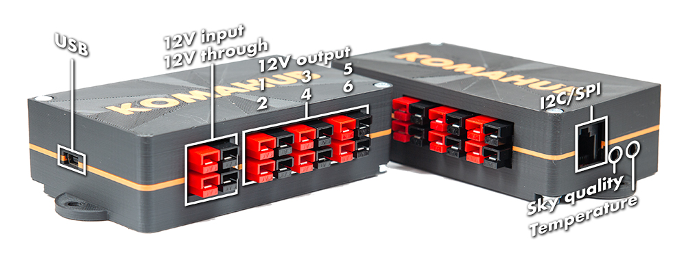
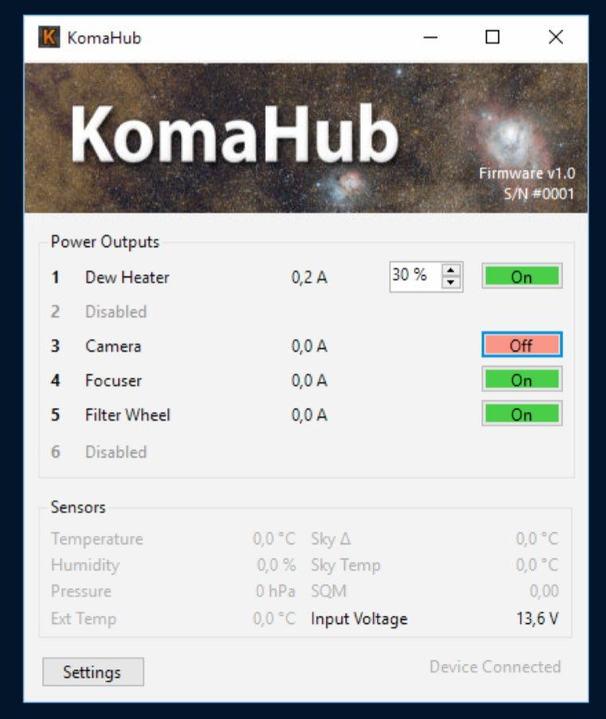

# KomaHub - kotimainen sähkölaatikko tähtikuvaukseen

KomaHub on Komakalliolla kehitetty apulaite tähtikuvaukseen. KomaHubilla korvaat perinteisen rinnankytketyn 12 voltin sähkönjakolaatikon ja saat hienoja lisäominaisuuksia.

Laite on erityisen hyödyllinen etäkäyttöisessä observatoriossa, jossa on tarve käynnistää ja sammuttaa 12 voltilla toimivia laitteita etänä ja tarkkailla niiden virrankulutusta. Lisäksi KomaHubiin on mahdollista kytkeä useita erilaisia antureita, joiden avulla voi tarkkailla kuvausolosuhteita ja tallentaa tämän tiedon suoraan raakakuvien metadataksi.

Tyypillisiä käyttökohteita ovat esimerkiksi:
- Temppuilevan laitteen korjaaminen katkaisemalla virrat
- CCD-kameran sammuttaminen päiväsajaksi, jos kameran tuuletin muuten pyörisi aina kun virta on kytkettynä
- Laitteiden pitäminen virroissa tiivistyvän kosteuden välttämiseksi
- Huurrepantojen automaattinen säätö kuvauksen aikana
- Taivaan pimeyden ja muiden suureiden mittaaminen kuvatessa

Ominaisuudet:
- Kuusi yksittäin tietokoneella ohjattavaa virtaulostuloa
  - Maksimi 8 A per portti, yhteensä 15 A
  - Jatkuva virtamittaus per portti
  - Ohjelmallisesti toteutettu nopea sulake käyttäjän valitsemalla virtarajoituksella
- Yksi jatkuvasti päällä oleva virtaulostulo (kytketty rinnan sisääntulon kanssa)
- Jokaiseen kuudesta ulostulosta voi määrittää PWM:n esim. huurrepannan ohjaamista varten
- Sisääntulojännitteen mittaus
- Laadukkaat Powerpole-liittimet
- Mahdollisuus kytkeä ulkoisia antureita (lämpötila, paine, kosteus, pilvisyys, taustataivaan kirkkaus)
- Atmel ATmega32U4 mikrokontrolleri
- Toimii USB HID-laitteena - ei sarjaporttiajureiden asentelua!
- Ohjausohjelma Windowsille
- ASCOM-ajurit ObservingConditions ja SafetyMonitor -rajapinnoille
- Kaikki lähdekoodi (firmware, protokollat, ajurit ja ohjelmisto) ja piirilevysuunnittelu on avoimesti jaossa

## Kytkennät

KomaHub kytketään tietokoneeseen Mini-USB-liittimellä. Lisäksi laitteelle syötetään 12 voltin käyttöjännite alla olevaan kuvaan merkityn Powerpole-liittimen kautta (**12V input**). Syöttöjännitteelle tarkoitetun liittimen alapuolella on toinen Powerpole-liitin, joka on kytketty rinnakkain syöttöjännitteen kanssa. Tästä liittimestä voi jakaa 12 V sähkön laitteille, joiden haluat aina olevan päällä, esim. USB-hubi, johon KomaHub on kytketty.

12 V syötön tulee olla aina kytkettynä. KomaHub osaa toimia itsenäisesti ilman tietokonetta pitäen voimassa sille määritellyt asetukset, joten se ei ota sähköä USB:n kautta eikä näin toimi ilman sähkönsyöttöä.



Kuvaan merkityt **12V output** -liittimet ovat KomaHubilla ohjattavia laitteita varten. Liittimet on numeroitu kuvassa näkyvässä järjestyksessä.

Lisäksi laitteen kyljessä ovat RJ45- ja 3,5 mm stereoliittimet erilaisia oheisantureita varten. Reunimmainen 3,5mm liitin on lämpötilasensoreita varten (**Temperature**), keskimmäinen 3,5mm liitin TSL237-valoisuusanturia varten (**Sky quality**) ja RJ45-liitin I2C/SPI -väyliin liitettäviä antureita varten (**I2C/SPI**), esim. lämpötila/ilmanpaine/kosteus (BME280) tai pilvisensori (MLX90614). Kun anturit eivät ole käytössä, voi kotelon kyljen teipata umpeen, jotta sisälle ei mene ulkokäytössä kosteutta tai ötököitä.

## Windows-ohjelman käyttö

KomaHubia ohjataan Windows-työpöytäohjelmalla, jonka käyttöliittymästä näet kuvakaappauksen alla. **Power Outputs** -otsikon alta näet listauksen kaikista kuudesta virtalähdöstä sekä niiden tilasta. Jokaiselle lähdölle voi antaa nimen, joka vastaa lähtöön kytkettyä laitetta. Käyttöliittymä näyttää myös jokaisen lähdön virrankulutuksen, sekä antaa mahdollisuuden kytkeä kukin lähtö päälle tai pois klikkaamalla **On/Off**-nappia.

Jos lähdön tyypiksi on asetuksissa valittu PWM, näkyy lähdölle myös käyttöjakson säätö (0-100%). Tällä voi esimerkiksi lämmityspantojen tapauksessa säätää lämmitystehoa.



**Sensors**-otsikon alta näet kaikkien KomaHubiin kytkettyjen anturien tilan. Listan lopusta löytyy myös mitattu syöttöjännite. Syötetyn jännitteen tulisi olla välillä 12-14 V.

**Settings**-nappia painamalla voit säätää KomaHubin käyttämiä asetuksia. Jokaiselle lähdölle voi valita nimen, tyypin sekä sulakkeen käyttämän virtarajan.

Lähtöjen tyypit ovat seuraavanlaiset:
- **12V** - Lähtö on normaalisti käytössä ja antaa 12 voltin jännitettä
- **PWM** - Lähtö antaa säädettävää PWM-jännitettä, jolla voi ohjata esimerkiksi lämmityspantoja
- **OFF** - Lähdön käyttö on kokonaan estetty ja näkyy käyttöliittymässä *Disabled*-tilassa

## Linux-tuki

Jarno Paananen on tehnyt KomaHubille INDI-ajurin, joka löytyy osoitteesta https://github.com/jpaana/indi-komahub.

## Sensorikytkennät

KomaHubiin voidaan liittää monenlaisia sensoreita. Laite havaitsee kytketyt sensorit kun siihen kytketään virta, ja välittää niillä mitatut tiedot tietokoneelle, jossa niitä voi seurata KomaHubin ohjaussovelluksella.

**Huom!** Älä kytke tai irroita sensoreita kun KomaHubissa on virrat!

### One-wire lämpötila-anturit

KomaHubiin voidaan kytkeä ketjuun 1-4kpl DS18B20 lämpötila-anturia. Anturit johdotetaan 3,5mm TRS-stereoplugiin seuraavasti:

- Tip = +5V
- Ring = Data
- Sleeve = GND

KomaHub tunnistaa antureiden lukumäärän käynnistyessään. Mittaus tehdään neljälle anturille, joista KomaHubin ohjaussovellus näyttää kaksi ensimmäistä.

### TSL237 valoisuusanturi

TSL237-valoisuusanturilla voidaan mitata taivaan kirkkautta. Lopputuloksena saadaan vastaava magnitudia/neliökaarisekunti-tulos kuin Unihedronin valmistamilla SQM-mittareilla. Luotettavan tuloksen saamiseksi anturi tarvitsee eteensä IR:n ja UV:n leikkaavan suodattimen sekä linssin jolla mittaukseen haluttu kuvakenttä kohdistetaan anturiin.

Itse anturi muuttaa kirkkauden taajuuspulssiksi jota KomaHubin mikrokontrolleri lukee. Taajuus **f** muunnetaan mag/arcsec^2 -lukemaksi kaavalla `22 - 2.5 * log10(f)`. Mitattu taajuuslukema on myös saatavilla omia laskelmia varten ohjaussovelluksessa tooltippinä osoittamalla hiirellä Sky Quality -lukemaa.

Laite johdotetaan 3,5mm TRS-stereoplugiin seuraavasti:

- Tip = Vdd (2)
- Ring = OUT (3)
- Sleeve = GND (1)

Lisäksi laitteen lähelle Vdd ja GND -linjojen väliin tulee liittää 0.1uF -kondensaattori.

**Huom!** Valoisuusanturin tuloksia ei ole vielä päästy vertaamaan ja kalibroimaan oikean SQM-mittarin kanssa. Käyttäjäkokemuksia otetaan vastaan!

### BME280 lämpötila/ilmanpaine/kosteus

BME280 on Boschin valmistama edullinen yhdistelmäanturi, josta saadaan kerralla paikallinen lämpötila, ilmanpaine, kosteus ja näistä edelleen laskettua kastepiste. Anturia saa valmiina I2C breakout-lautana, joka johdotetaan KomaHubin RJ45-liittimeen seuraavasti:

- 1 = +5V
- 3 = GND
- 5 = SCL
- 7 = SDA

Valmiissa breakout-laudoissa on yleensä I2C-väylän tarvitsemat pull-up -vastukset valmiina. Omia rakennelmia tai laitteiden ketjuttamista varten KomaHubissa on myös omat ylösvetovastukset jotka saa käyttöön sulkemalla KomaHubin piirilevyltä kaksi "I2C PULL-UP" -jumpperia.

### MLX90614-sensori pilvisyyden mittaamiseen

MLX90614 on komponentti, joka mittaa kohteesta saapuvan lämpösäteilyn määrää.  Lisäksi siinä on oma lämpötilamittarinsa paikallista referenssilämpötilaa varten. Tällä yhdistelmällä voidaan mitata taivaan pilvisyyttä mittaamalla taivaan ja ilman lämpötilan erotusta. Selkeä taivas on kylmempi kuin pilvinen, joten erotuksen ollessa suuri on keli todennäköisesti selkeä.

Laitetta saa valmiina breakout-lautana, joka liitetään I2C-väylään samalla tavalla kuin BME280:

- 1 = +5V
- 3 = GND
- 5 = SCL
- 7 = SDA

### Muut sensorit

RJ45-liittimeen voidaan kytkeä myös muita I2C- tai SPI-väyliin liitettäviä laitteita. Näille täytyy kuitenkin toteuttaa tuki KomaHubin firmwareen tapauskohtaisesti. Liittimen kytkennät ovat:

- 1 = +5V
- 2 = SS
- 3 = GND
- 4 = SCLK
- 5 = SCL
- 6 = MOSI
- 7 = SDA
- 8 = MISO

## Komentoriviohjaus

KomaHubin Windows-sovelluksessa on REST-verkkorajapinta, jolla laitetta on mahdollista ohjata omista sovelluksista käsin. KomaHubin ASCOM-ajurit käyttävät myös näitä rajapintoja. Komentorivillä näitä voidaan ohjata esim. `curl`-työkalulla.

### Lähtöjen kytkentä päälle/pois

`curl -x POST http://localhost:6563/output/1/on`  
`curl -x POST http://localhost:6563/output/1/off`

jossa `output` on lähdön numero 1-6.

### Sensorien lukeminen

`curl http://localhost:6563/sensors`

Tämä kutsu tuottaa seuraavanlaisen JSON-dokumentin joka sisältää sensoreilta viimeksi luetut arvot. Jos vastaavaa sensoria ei ole kytketty, kyseinen osio tai lukema jää vastauksesta kokonaan pois. `power`-osio on kuitenkin aina mukana, sillä se on KomaHubiin sisäänrakennettuna.
```
{
  "pth" : { "temperature": 3.5, "humidity": 70.5, "pressure": 1001.5, "dewpoint": -3.2 },
  "skyquality" : { "magnitude": 21.3, "frequency": 1005 },
  "skytemperature" : { "sky": -15.3, "ambient": 0.2 },
  "power" : { "inputvoltage": 12.5, "outputcurrent": [ 0.0, 0.0, 0.0, 0.0, 0.0, 0.0 ] },
  "temperatures": [ 10.5, 9.5 ]
}
```
